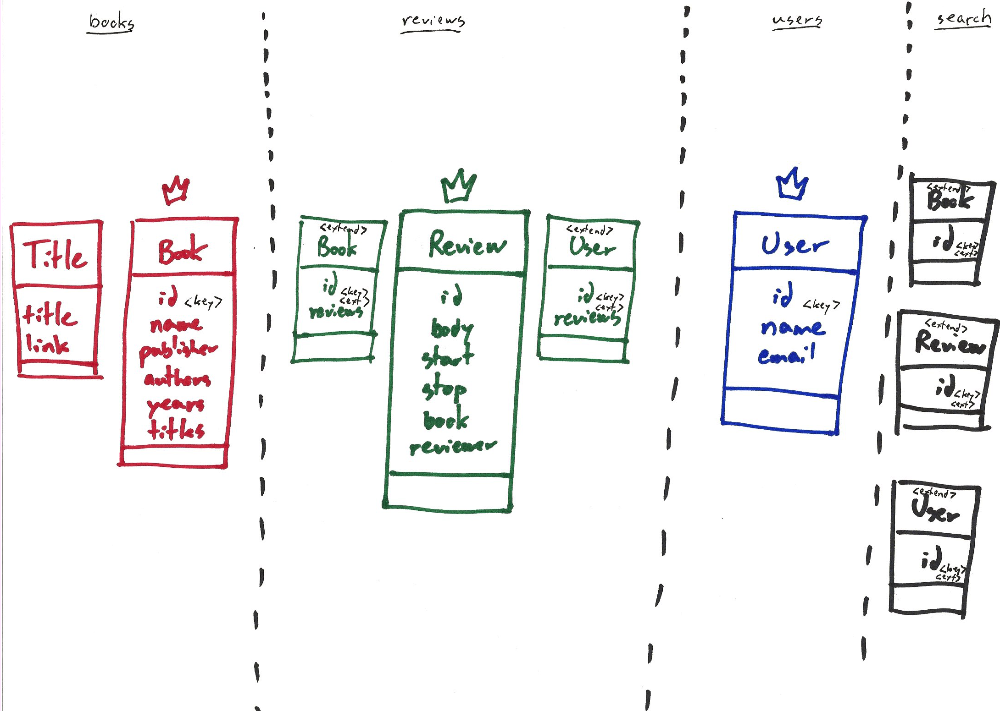
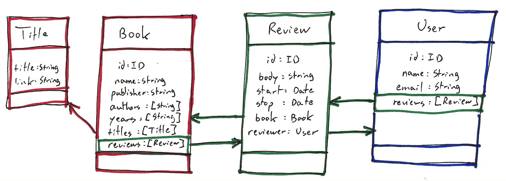

# Book Reviews

This is a sample set of applications that show how to put book reviews in a
federated GraphQL schema.

There are five underlying services:



- `books` has per-book data
- `users` has per-user data
- `reviews` has the reviews themselves
- `search` runs the search query
- `signatures` augments users with a fancier signature

These five services each define a part of overall schema.  The `gateway` service
ties them all together into a single, unified schema.



## Running It

### Initial Setup

#### Install Node Packages

Each service is a Node app.  You need to run `npm install` to fetch their
dependencies.

```bash
for service in books reviews users search signatures jwts gateway
do
    echo '==========' $service '=========='
    (cd $service; npm install)
done
```

#### Configure Local Environments

You also need to specify their environment specifics in their `.env` file.  The
template has sensible values for connecting to Kafka, but you need to supply
your own key for signing JWTs.

```bash
for service in books reviews users search signatures jwts gateway
do
    echo '==========' $service '=========='
    (cd $service; cp .env.template .env)
done
```

Edit each `.env` file to specify the signing key.  Make sure you use the same
value in each service.

#### Re-Sign Bootstrap Credentials

You will also need to sign the forged credentials in `seed.sh` and
`Books_node_graphql_federation_helpers.sh`, called `JWT_AUTH_TOKEN`.  You can do
so by entering the existing JWT at [JWT.io](https://jwt.io/), providing your
local signing key, and copying the resulting JWT back to the two scripts.

### Using Docker Compose

```bash
docker compose up -d
```

This will run each federated service nicely hidden inside a Docker network,
where each one appears as its own host, using the default HTTP port 80.  For
example, within the Docker network, the books service lives at `http://books/`.

The gateway runs inside the Docker network as its own host and using the default
HTTP port 80.  Inside the Docker network, it lives at `http://gateway`.  But it
also maps the host's port 4000 to its port 80.  This way, from outside the
Docker network, it lives at `http://localhost:4000` like a normal Node app.

### Running Them Manually

If you are not using Docker Compose, each application runs directly on the host
machine.  Since they will share the IP address, we use different port numbers to
communicate with each one.  For example, the books service lives at
`http://localhost:4001`.

#### Starting Kafka

It is much easier to run Kafka using Docker Compose.

```bash
docker compose --file docker-compose.yml --file docker-compose.kafka-override.yml up -d kafka
```

> NOTE: Switching Docker Compose files will reset the Kafka broker and you will
> lose all data recorded so far.

#### Starting the Federated Services

```bash
for service in books reviews users search signatures jwts
do
    echo '==========' $service '=========='
    (cd $service; npm start &)
done
```

If you define the `DEBUG` environment variable, the services will output extra
information about their internal state as they process requests and messages.

#### Starting the Gateway

```bash
(cd gateway; npm start &)
```

The gateway lives at `http://localhost:4000` like a normal Node app.

When the gateway is running, you can update your graph schema in Apollo Studio.
You will need the API key from
[Apollo Studio](https://studio.apollographql.com/).  Once you have obtained it,
copy the `.env.template` file to `.env` and put your key in the placeholder.
Use `apollo service:push` to read your local federated graph schema and upload
it to Apollo Studio.

```bash
(cd gateway; apollo service:push)
```

### Seed Data

You can seed the system by running the `seed.sh` script in the top folder.

It creates two users:

- Jean Tessier
- Simon Tolkien

It creates six books:

- The Hobbit
- The Lord of the Rings
- The Fellowship of the Ring
- The Two Towers
- The Return of the King
- The Silmarillion

With a sampling of reviews by the two users.

### Real Data

You can reset Kafka with this command:

```bash
docker compose --file docker-compose.yml --file docker-compose.kafka-override.yml up -d --force-recreate kafka
```

This command will add data derived from `../data/Books_????-??-??*.md`.

```bash
./Books_node_graphql_federation.pl | bash
```

## Sample Queries

You can access [`Playground`](http://localhost:4000) and copy the sample queries
and their variables to the UI to call them easily.

### Searching

Here is a sample `search` query.  It shows the titles of matching books, the
bodies of matching reviews, and the names of matching users.

```graphql
query MySearch($q: String!) {
    search(q: $q) {
        ... on Book {
            titles {
                title
            }
        }
        ... on Review {
            body
        }
        ... on User {
            name
        }
    }
}
```

If you call it with the following variables:

```json
{
  "q": "tolkien"
}
```

It will return information about the user Simon Tolkien and all four books,
because they were authored by J.R.R. Tolkien.

If you call the same query with the variables:

```json
{
  "q": "tessier"
}
```

It will return the user Jean Tessier.  To get to the four reviews that were
written by Jean Tessier, simply follow the `reviews` association from the
GraphQL schema.

If you use the variables:

```json
{
  "q": "jean tolkien"
}
```

It will return both users and all the books, because each one is related to at
least one of these words.

#### Query Plan

If you need to know how the `search` chose and ranked the results to a query,
you can ask it to show its work with the `queryPlan` top-level GraphQL field.

```graphql
query MySearch($q: String!) {
    queryPlan(q: $q) {
        words
        indices {
            word
            entries {
                score
                id
                type
            }
        }
        results {
            totalWeight
            weights {word weight}
            id
            type
        }
    }
}
```

With the same variables as the `search` query.  For example:

```json
{
  "q": "jean tolkien"
}
```

The `words` section of the plan shows how the `search` service parsed the query.

The `indices` section shows the internal indices of the `search` service that
were relevant to the query.

The `results` section shows how the `search` service computed the search
results.

#### Looking Up a Specific Entity

Say you are building a page that shows a book.  How do you fetch the information
about that book in order to populate the page?

Search for its ID with this query:

```graphql
query MySearch($q: String!) {
    search(q: $q) {
        __typename
        ... on Book {
            id
            titles {
                title
            }
            authors
            reviews {
                id
                reviewer {
                    id
                    signature
                }
            }
        }
        ... on Review {
            id
            book {
                id
                titles {
                    title
                }
                authors
            }
            reviewer {
                id
                signature
            }
            body
            start
            stop
        }
        ... on User {
            id
            name
            reviews {
                id
                book {
                    id
                    titles {
                        title
                    }
                }
            }
        }
    }
}
```

If you call it with the ID of an entity:

```json
{
  "q": "53d01334-37f9-45bc-85fc-06b3f8a9bbf4"
}
```

The search will return a single entry, either a `Book`, `User`, or `Review`, as
the case may be.

Alternatively, since you already know it's a book, you can go straight to the
`books` microservice with this query:

```graphql
query MyBook($id: ID!) {
    book(id: $id) {
        titles {
            title
        }
        authors
        reviews {
            id
            reviewer {
                id
                signature
            }
        }
    }
}
```

And call it with the ID of the book:

```json
{
  "id": "53d01334-37f9-45bc-85fc-06b3f8a9bbf4"
}
```

### Adding Content

#### Adding a Book

You can use this query to create a new book entry:

```graphql
mutation AddBook($b: AddBookInput!) {
    addBook(book: $b) {
        id
        name
    }
}
```

And structure the variables like this:

```json
{
  "b": {
    "name": "The_Silmarillion",
    "titles": [
      {
        "title": "The Silmarillion",
        "link": "https://en.wikipedia.org/wiki/The_Silmarillion"
      }
    ],
    "publisher": "Unwin & Allen",
    "authors": [
      "J.R.R. Tolkien",
      "Christopher Tolkien"
    ],
    "years": ["1977"]
  }
}
```

> You need admin privileges to add books.

#### Adding a User

You can use this query to sign up as a new user:

```graphql
mutation SignUp($u: SignUpInput!) {
    signUp(user: $u) {
        id
        name
    }
}
```

And structure the variables like this:

```json
{
  "u": {
    "name": "Christopher Tolkien",
    "email": "chris@tolkien.com",
    "password": "abcd1234"
  }
}
```

If you have admin privileges, you can use this other query to register a new
user:

```graphql
mutation AddUser($u: AddUserInput!) {
    addUser(user: $u) {
        id
        name
    }
}
```

And structure the variables like this:

```json
{
  "u": {
    "name": "Christopher Tolkien",
    "email": "chris@tolkien.com",
    "password": "abcd1234",
    "roles": [ "ROLE_USER" ]
  }
}
```

#### Adding a Review

You can use this query to add a new review:

```graphql
mutation AddReview($r: AddReviewInput!) {
    addReview(review: $r) {
        id
        book {
            name
        }
        reviewer {
            name
        }
    }
}
```

And structure the variables like this:

```json
{
  "r": {
    "reviewerId": "<id of the reviewer goes here>",
    "bookId": "<id of the book being reviewed goes here>",
    "body": "This book is quite fascinating, so far.",
    "start": "2020-05-21"
  }
}
```

If you are signed in, you can omit `reviewerId` from the variables and the
system will use your user credentials when creating the review.

### Removing Content

#### Removing a Book

> You need admin privileges to remove books.

You can use this query to remove an existing book entry:

```graphql
mutation RemoveBook($id: ID!) {
    removeBook(id: $id)
}
```

And structure the variables like this:

```json
{
  "id": "<id of the book being removed goes here>"
}
```

Removing a book will automatically remove all the reviews about that book.

#### Removing a User

> You need admin privileges to remove other users.

You can use this query to remove an existing user:

```graphql
mutation RemoveUser($id: ID!) {
    removeUser(id: $id)
}
```

And structure the variables like this:

```json
{
  "id": "<id of the user being removed goes here>"
}
```

Removing a user will automatically remove all the reviews by that user.

#### Removing a Review

> You need admin privileges to remove other users' reviews.

You can use this query to remove an existing review:

```graphql
mutation RemoveReview($id: ID!) {
    removeReview(id: $id)
}
```

And structure the variables like this:

```json
{
  "id": "<id of the review being removed goes here>"
}
```

### Making Authenticated GraphQL Calls

Use this mutation to sign in and get a JWT:

```graphql
mutation Login($loginInput: LoginInput!) {
  login(input: $loginInput) {
    jwt
  }
}
```

With the following variables:

```json
{
  "loginInput": {
    "email": "jean@jeantessier.com",
    "password": "abcd1234"
  }
}
```

The response will look like:

```json
{
  "data": {
    "login": {
      "jwt": "eyJ0...P9Pk"
    }
  }
}
```

> Handy one-liner:
> ```bash
> export JWT_AUTH_TOKEN=$(http :4000 query='mutation Login($loginInput: LoginInput!) {login(input: $loginInput) {jwt}}' variables:='{"loginInput": {"email": "jean@jeantessier.com", "password": "abcd1234"}}' | jq --raw-output '.data.login.jwt')
> ```

If the authentication fails, whether it's because the email address is unknown
or because the password doesn't match, you will get an error that will look like
this:

```json
{
    "data": {
        "login": null
    },
    "errors": [
        {
            "message": "No user with email jean@jeantessier.com",
            "path": [
                "signIn"
            ]
        }
    ]
}
```

## Extracting the Schema

You can extract the federated shema from services that you started manually.

> NOTE: You will need Apollo's `rover` tool to
> [extract the GraphQL schema](https://www.apollographql.com/docs/federation/quickstart/).
> ```bash
> npm install -g @apollo/rover
> ```

```bash
extract_schema.sh
```
